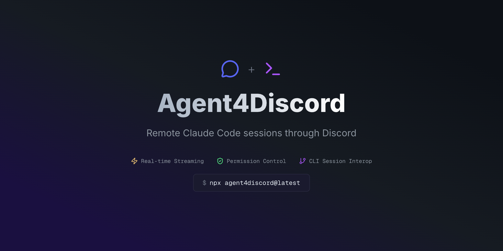
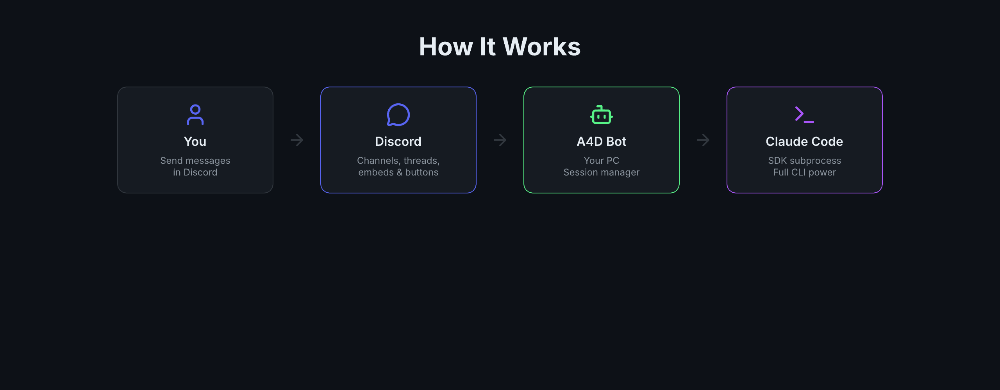
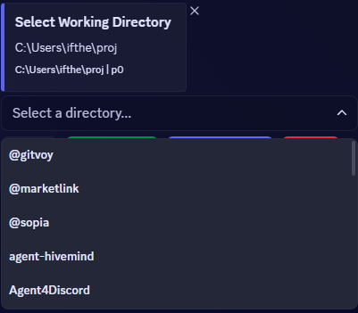
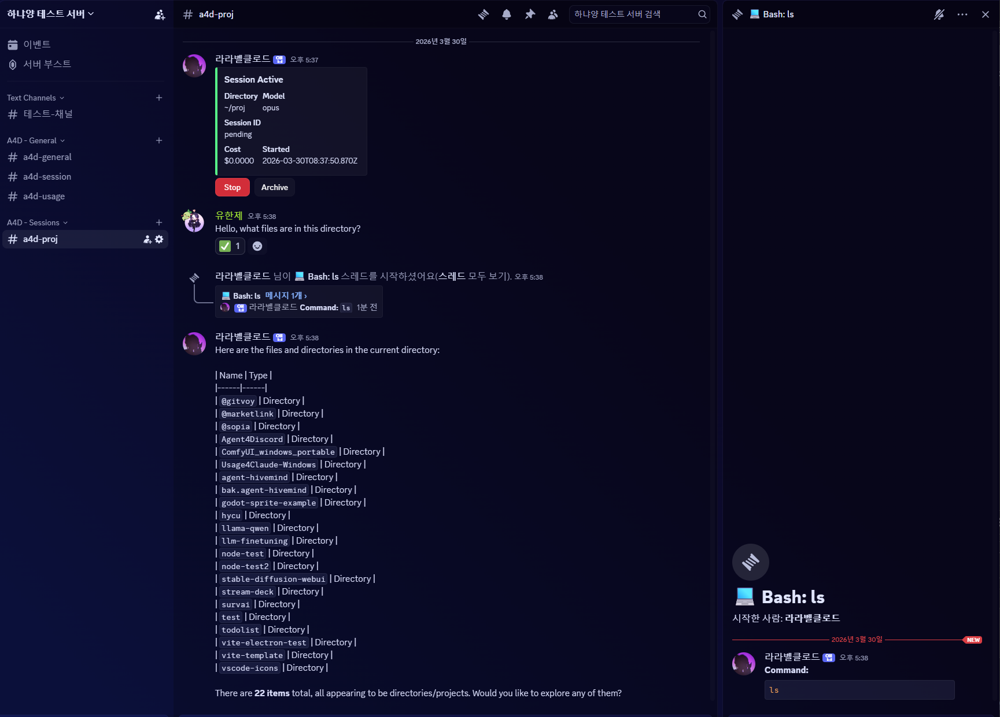
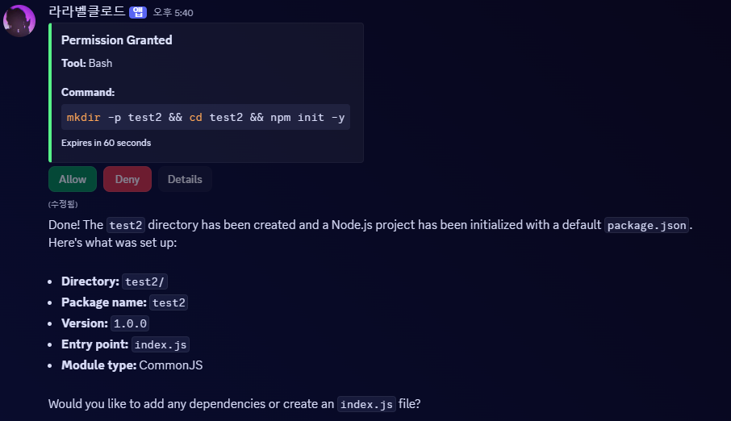

<p align="center">
  
</p>

<p align="center">
  <strong>Discord를 통한 원격 Claude Code 세션</strong>
</p>

<p align="center">
  <a href="README.md">English</a>
</p>

---

Agent4Discord (A4D)는 [Claude Code](https://docs.anthropic.com/en/docs/claude-code)를 Discord 채널에서 사용할 수 있게 해주는 셀프호스트 Discord 봇입니다. 각 세션은 전용 채널에 매핑되고, 도구 호출은 스레드에 표시되며, 권한 요청은 인터랙티브 버튼으로 나타납니다.

**내 PC. 내 봇. 내 Claude Code 세션.**

## 동작 방식

<p align="center">
  
</p>

1. 본인의 Discord 봇 토큰으로 PC에서 봇을 실행
2. `/a4d init`으로 Discord 서버에 채널 구조 생성
3. 작업 디렉토리를 선택하고 Claude Code 세션 시작
4. Discord에서 Claude와 대화 — 스트리밍, 도구 호출, 권한 승인 모두 지원

## 주요 기능

- **디렉토리 브라우저** — 셀렉트 메뉴와 버튼으로 파일시스템 탐색
- **모델 선택** — 세션 시작 시 opus/sonnet/haiku 선택 (기본값: opus)
- **실시간 스트리밍** — 텍스트 출력, 생각, 도구 진행률을 라이브 업데이트 임베드로 표시
- **도구 호출 스레드** — 각 도구 실행이 포맷된 입출력과 함께 개별 스레드로 생성
- **권한 제어** — 위험한 작업에 Allow/Deny 버튼 (안전한 도구는 자동 허용)
- **세션 재개** — CLI에서 만든 세션이나 중단된 세션을 `/a4d resume`으로 재개
- **사용량 트래커** — `#a4d-usage` 채널에서 세션 비용, 토큰, 속도 제한 표시
- **플러그인 지원** — 설치된 Claude Code 플러그인 (스킬, 훅) 자동 로드
- **CLI 연동** — CLI와 동일한 JSONL 저장소를 공유하여 세션 호환

### 디렉토리 브라우저


### 세션 스트리밍


### 권한 요청


## 빠른 시작

### 사전 요구사항

- **Node.js** >= 20.x
- **Claude Code** 인증 완료 (`claude login` 또는 `ANTHROPIC_API_KEY`)
- **Discord 봇 토큰** ([여기서 생성](https://discord.com/developers/applications))

### 설정

```bash
npx agent4discord@latest --setup
```

설정 마법사가 안내합니다:
1. Discord 봇 토큰 입력
2. Client ID 입력
3. Message Content Intent 활성화 확인
4. 초대 URL 생성 및 브라우저 열기

### 실행

```bash
npx agent4discord@latest
```

### Discord에서

1. 서버에서 `/a4d init` 실행
2. `#a4d-session`에서 디렉토리 탐색
3. **Session Start** 클릭, 모델 선택, 대화 시작

## 명령어

| 명령어 | 설명 |
|---|---|
| `/a4d init` | 서버에 A4D 채널 구조 생성 |
| `/a4d resume` | 현재 채널에서 중단된 세션 재개 |
| `/a4d model <opus\|sonnet\|haiku>` | 세션 중 모델 변경 |

## 채널 구조

```
A4D - General
├── #a4d-general      — 상태 메시지
├── #a4d-session      — 디렉토리 브라우저 & 세션 시작
└── #a4d-usage        — 사용량 & 속도 제한 트래커

A4D - Sessions
├── #a4d-myproject    — 활성 세션 채널
└── #a4d-another      — 다른 세션
```

## 설정 파일

`~/.agent4discord/config.json`에 저장됩니다:

```json
{
  "discordToken": "봇-토큰",
  "discordClientId": "클라이언트-ID",
  "claudeModel": "opus",
  "permissionMode": "default",
  "logLevel": "info"
}
```

## 개발

```bash
git clone https://github.com/raravel/Agent4Discord.git
cd Agent4Discord
npm install

# 자동 리로드 개발 모드
npx tsx watch src/cli.ts

# 타입 체크
npx tsc --noEmit
```

## 라이선스

MIT
